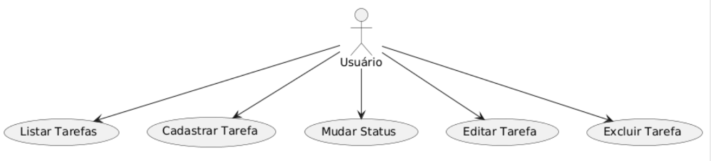
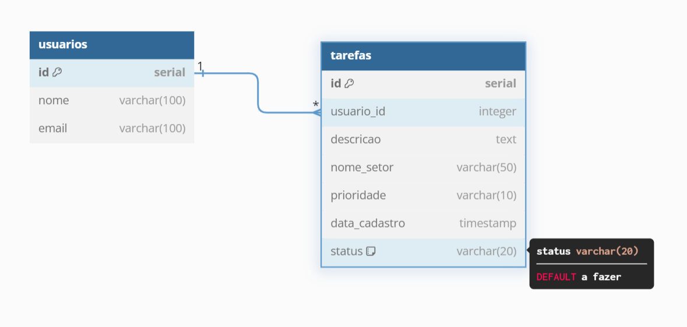

# Gerenciamento de Tarefas

Este projeto tem como objetivo a criação de um sistema para gerenciamento de tarefas, com um banco de dados relacional para armazenar informações sobre usuários e tarefas.

## Diagrama de Caso de Uso

## Diagrama de Relacionamento de Entidades

## Criação do Banco de Dados

Para criar o banco de dados e as tabelas, execute os seguintes comandos SQL:

### 1. Criar o Banco de Dados

## Criação da DATABASE

CREATE DATABASE gerencia_tarefas

## Tabela de Usuarios

CREATE TABLE usuarios (
  id SERIAL PRIMARY KEY,
  nome VARCHAR(100) NOT NULL,
  email VARCHAR(100) NOT NULL UNIQUE
);

## Tabela de Tarefas

CREATE TABLE tarefas (
  id SERIAL PRIMARY KEY,
  usuario_id INTEGER REFERENCES usuarios(id),
  descricao TEXT NOT NULL,
  nome_setor VARCHAR(50) NOT NULL,
  prioridade VARCHAR(10) CHECK (prioridade IN ('baixa', 'média', 'alta')),
  data_cadastro TIMESTAMP DEFAULT CURRENT_TIMESTAMP,
  status VARCHAR(20) CHECK (status IN ('a fazer', 'fazendo', 'pronto')) DEFAULT 'a fazer'
);
